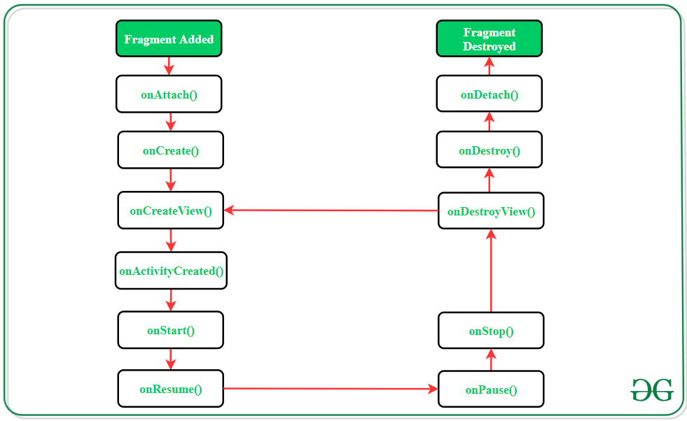

# DSI Android App

## Android Material Design

https://material.io/components?platform=android

---

## Activity Lifecycle

---

## Fragment Lifecycle--

---

## Activity vs Fragment

[Difference between fragment and an activity](https://www.geeksforgeeks.org/difference-between-a-fragment-and-an-activity-in-android/)

| Activity | Fragment |
| ----------- | ----------- |
| Activity is an application component that gives a user interface where the user can interact.  | The fragment is only part of an activity, it basically contributes its UI to that activity. |
| Activity is not dependent on fragment | Fragment is dependent on activity. It can’t exist independently. |
| We need to mention all activity it in the manifest.xml file | Fragment is not required to mention in  the manifest file. |
| We can’t create multi-screen UI without using fragment in an activity. | After using multiple fragments in a single activity, we can create a multi-screen UI. |
| Activity can exist without a Fragment| Fragment cannot be used without an Activity. |
| Creating a project using only Activity then it’s difficult to manage. | While Using fragments in the project, the project structure will be good and we can handle it easily. |
| Lifecycle methods are hosted by OS. The activity has its own life cycle. | Lifecycle methods in fragments are hosted by hosting the activity. |
| Activity is not lite weight. | The fragment is the lite weight. |

---

## Fragment Architecture

### Layout File

> UI layout definition

res/layout/fragment_**NAME**.xml

### UI Class

> UI controller

java/namespace/**NAME**/**NAME**Fragment.java

### Model

> Data definition

java/namespace/**NAME**/**NAME**.java

### View Model

> Prepares data for viewing and reacts to user interactions

java/namespace/**NAME**/**NAME**ViewModel.java

### Repository

> Provide a clean API so that the rest of the app can retrieve data easily

java/namespace/**NAME**/**NAME**Repository.java

### Data Access Object (Dao)

> Model injected into the database

java/namespace/**NAME**/**NAME**Dao.java

### Database

> Persist data locally

java/namespace/**NAME**/**NAME**Database.java

[Room Example](https://developer.android.com/training/data-storage/room)

## Testing

Testing according the Android testing pyramid (shown below) Illustrates how the app is including the three testing categories:

* Small tests: are unit tests that validate your app's behavior one class at a time. (Unit testing)
* Medium tests: are integration tests that validate either interactions between levels of the stack within a module, or interactions between related modules. (Integration testing)
* Large tests: are end-to-end tests that validate user journeys spanning multiple modules of your app. (UI testing)

#### Testing pyramid

###

Implemented [Espresso](https://developer.android.com/training/testing/espresso) framework to execute automation testing used on UI testing and Integration testing.

For running the test on your own device you can either configure IntelliJ to run them or run them directly with the OS.

#### Configure Android Studio to run Automation test

> Go to your Run/Debug configurations, select **Android Instrumented Tests** as your  configuration, and select the module .app

#### Run the tests directly with the OS
Remember that for being able to run **Automation test** you must have either an emulator running or a physical device connected.

Windows users:
> Must install [gradle](https://gradle.org/install/) and configure your [path variables](https://docs.gradle.org/current/userguide/installation.html) so the Os can recognize gradle as a command, then you exectue the following command
> gradle /connectedAndroidTest

Linux / MacOs users:
 > Must install [gradle](https://gradle.org/install/) then run the test directly with gradle  command :
 > ./gradlew connectedAndroidTest

More information about Espresso workflow:

